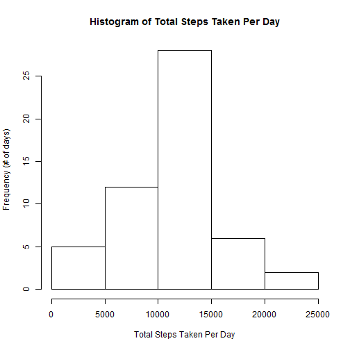
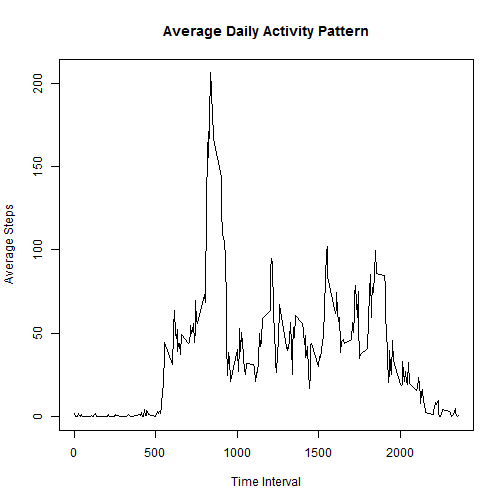

### Introduction
For the Assignment 1, we are given some data from a personal activity monitoring device which collects data at 5 mins through out the day for 2 months. The data we will analyze is from an anonymous individual collected during the months of October and November, 2012 and includes the number of steps taken in 5 minute intervals each day.


Before the analysis, the data should be loaded:

```r
data <- read.csv("activity.csv")
```

The dplyr package is also needed to be loaded for the analysis:

```r
library(dplyr)
```

There are three variables in this data set: "steps", "date", and "interval".  

The "interval"" variable is transformed to factor variable for further analysis.

```r
data$interval <- factor(data$interval)
```

The "date" variabe is also transformed to date variable for further analysis.  

```r
data$date <- as.Date(data$date, "%Y-%m-%d")
```


### 1. Average total number of steps taken a day
First of all, I'd like to do some simple analysis to know mean number of steps taken a day.

I started from calculating the total number of steps taken per day.

```r
data1<- group_by(data, date)
result1 <-summarize(data1, sumsteps= sum(steps))
```

Then I made a histogram of the total number of steps taken each day.

```r
hist(result1$sumsteps, main="Histogram of Total Steps Taken Per Day", xlab="Total Steps Taken Per Day", ylab="Frequency (# of days)")
```

 

From the graph, it is known that this individual takes 10000 to 15000 in most days.

Lastly, I calculated the mean and median of the total number of steps taken per day. (Missing values are ignored here.)

```r
mean_totalsteps <- mean(result1$sumsteps, na.rm=TRUE)
median_totalsteps <- median(result1$sumsteps, na.rm=TRUE)
```

The mean of the total numer of steps per day is 10766 steps.  
The median of the total number of steps per day is 10765 steps.   

### 2. Average Daily Activity Pattern
To understand the average daily activity pattern, first I summarized the data by calculating the mean steps of each interval throughout the day.

```r
data2 <- group_by(data, interval)
result2 <- summarize(data2, meansteps = mean(steps, na.rm=TRUE))
```

Then I plot a time series graph of the 5 minute interval (x-axis) and the average number of steps taken, average across all days (y-axis).

```r
result2$interval <- as.character(result2$interval)
plot(result2$interval, result2$meansteps, type="l", main="Average Daily Activity Pattern", xlab="Time Interval", ylab="Average Steps")
```

 

From the graph it is known that most steps are usually taken in the morning between 5am to 10am. 

To know the exact 5-minute interval which the maximum steps are taken, I use the arrange function in dplyr package to find out.

```r
arrange(result2,desc(meansteps))
```

```
## Source: local data frame [288 x 2]
## 
##    interval meansteps
## 1       835  206.1698
## 2       840  195.9245
## 3       850  183.3962
## 4       845  179.5660
## 5       830  177.3019
## 6       820  171.1509
## 7       855  167.0189
## 8       815  157.5283
## 9       825  155.3962
## 10      900  143.4528
## ..      ...       ...
```

The mximum steps are taken at the 8:35 interval in the morning. The average steps taken in this interval is 206 steps. 

### 3. Imputing Missing Values

### 4. Patterns Between Weekdays and Weekends


